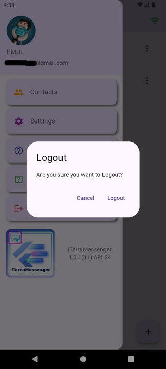

# iTerraMessenger

i9engine.app@gmail.com

2024 (c) 

on Flutter!

//************************************************************************
My experimental project - simple messenger!
Goal: To create a messaging application.

Technologies used: 
Firebase: 
Firebase Messaging, 
Firebase Auth, 
Firebase Storage, 
Firebase App check, 
Provider, 
flutter Bloc

//************************************************************************

Мой экспериментальный проект - простой мессенджер!
Цель: создать приложение для обмена сообщениями.

Использовались технологии:
Firebase: 
Firebase Messaging,
Firebase Auth, 
Firebase Storage,
Firebase App check, 
Provider, flutter Bloc

